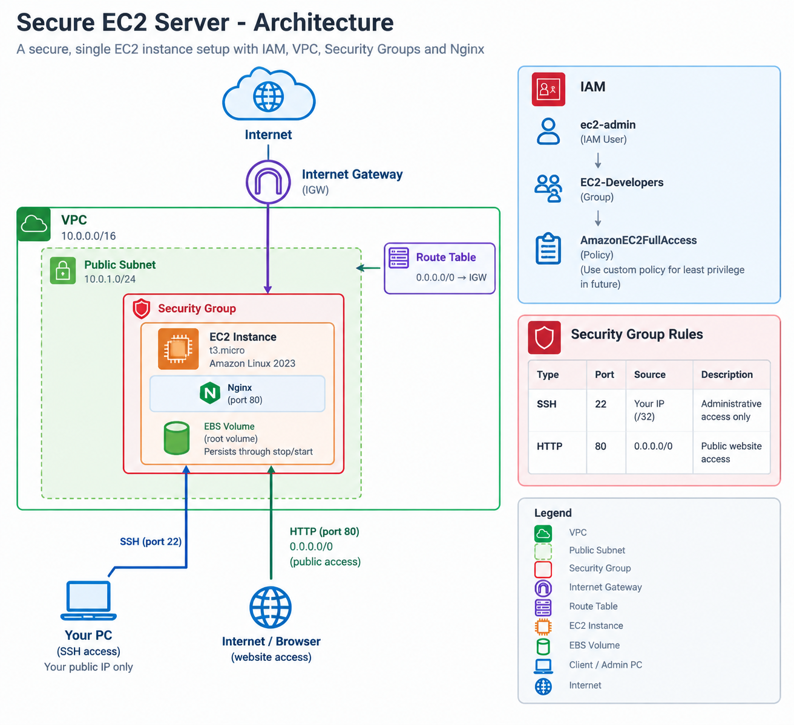

# Secure EC2 Server

A beginner AWS infrastructure project focused on securely deploying a Linux EC2 server and exposing a simple Nginx website to the internet.

## Architecture

> Architecture diagram will be added during the project.

## AWS Services

- IAM
- EC2
- VPC
- EBS
- Security Groups
- Key Pairs

## Goals

- Create an IAM user and group
- Configure EC2 permissions
- Deploy a Linux EC2 instance
- Configure secure SSH access
- Install and configure Nginx
- Serve a simple webpage
- Test EC2 stop/start behavior
- Document security decisions and infrastructure

## Security

SSH access will be restricted to the administrator's public IP.

HTTP access will be publicly available so that the Nginx website can be accessed from the internet.

## Project Status

🚧 In Progress

## Documentation

- [IAM Setup](docs/iam.md)
- [EC2 Setup](docs/setup.md)
- [Security Configuration](docs/security.md)
- [Testing](docs/testing.md)

## Architecture

